# Mermaid 预览测试集

用于检查 Markdown 预览中的 Mermaid 渲染，共 50 个独立示例。所有业务名称、数据与架构均为演示内容，不代表项目的实际设计。

示例以本仓库安装的 Mermaid 11.17.2 为校验基准；较旧的预览器可能不支持部分新图表。每段 `mermaid` 代码块都可以单独复制预览。

在 GitUI 中打开本文件，切换到「修改后预览」，并开启 Mermaid。可依次检查中文文字、浅深主题、缩放、宽图、长图，以及单块图表 / 源码切换。

语法参考：[Mermaid 官方文档](https://mermaid.js.org/intro/syntax-reference.html)。带 `beta` 的类型和 C4 类型可用于检查预览器的兼容性。

## 示例导航

| 范围 | 覆盖内容 |
| --- | --- |
| 01–08 | 流程图、方向、节点形状、子图、连线、样式、Markdown 标签 |
| 09–14 | 时序图、类图、状态图、实体关系图 |
| 15–23 | 用户旅程、甘特图、饼图、象限图、需求图、Git 图、思维导图、时间线 |
| 24–32 | 桑基图、XY 图、块图、数据包、看板、架构图、雷达图、矩形树图 |
| 33–37 | C4 上下文、容器、组件、动态、部署图 |
| 38–46 | 目录树、韦恩图、鱼骨图、Wardley、Cynefin、事件建模、泳道、铁路图、版本信息 |
| 47–50 | Frontmatter、无障碍说明、宽图、长图 |

## 01. 基础流程图：分支与回路

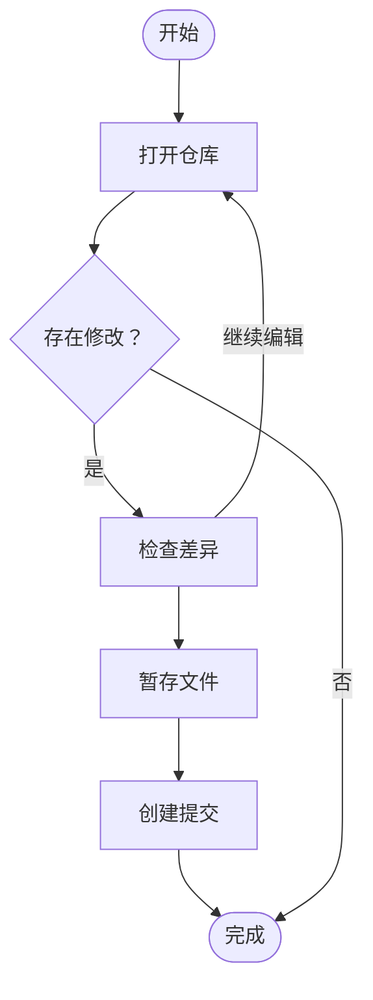
```mermaid
flowchart TD
    Start([开始]) --> Open[打开仓库]
    Open --> Changed{存在修改？}
    Changed -->|是| Review[检查差异]
    Review --> Stage[暂存文件]
    Stage --> Commit[创建提交]
    Commit --> Finish([完成])
    Changed -->|否| Finish
    Review -->|继续编辑| Open
```

## 02. 横向流程图：从左到右

```mermaid
flowchart LR
    Edit[编辑文件] --> Save[保存]
    Save --> Preview[预览差异]
    Preview --> Commit[提交]
    Commit --> Push[推送]
```

## 03. 传统节点形状

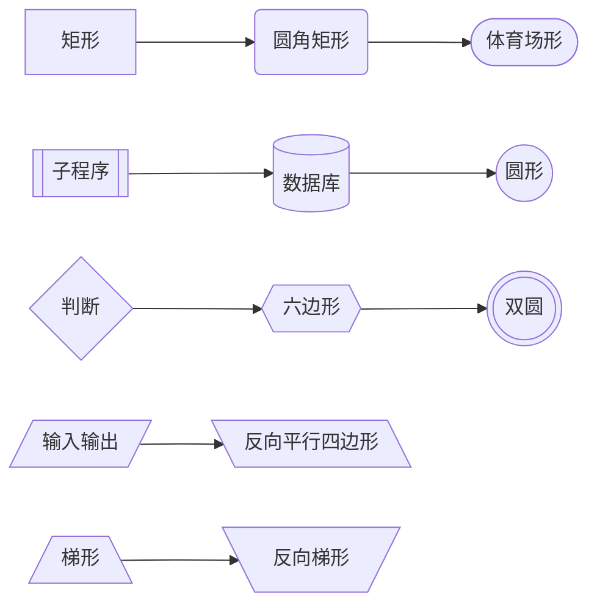
```mermaid
flowchart LR
    A[矩形] --> B(圆角矩形) --> C([体育场形])
    D[[子程序]] --> E[(数据库)] --> F((圆形))
    G{判断} --> H{{六边形}} --> I(((双圆)))
    J[/输入输出/] --> K[\反向平行四边形\]
    L[/梯形\] --> M[\反向梯形/]
```

## 04. 扩展节点形状

使用 `@{ shape: ... }` 检查新式节点声明。

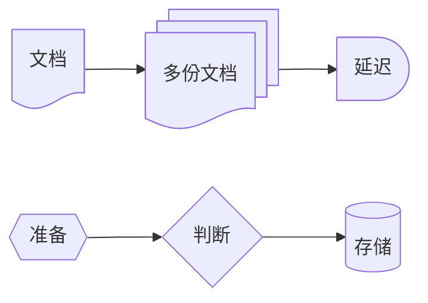
```mermaid
flowchart LR
    A@{ shape: doc, label: "文档" }
    B@{ shape: docs, label: "多份文档" }
    C@{ shape: delay, label: "延迟" }
    D@{ shape: hex, label: "准备" }
    E@{ shape: diam, label: "判断" }
    F@{ shape: cyl, label: "存储" }
    A --> B --> C
    D --> E --> F
```

## 05. 子图与分层

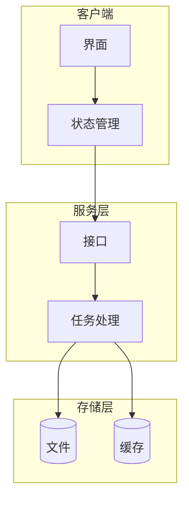
```mermaid
flowchart TB
    subgraph Client[客户端]
        direction LR
        View[界面] --> Store[状态管理]
    end
    subgraph Service[服务层]
        direction LR
        API[接口] --> Worker[任务处理]
    end
    subgraph Storage[存储层]
        Files[(文件)]
        Cache[(缓存)]
    end
    Store --> API
    Worker --> Files
    Worker --> Cache
```

## 06. 连线与箭头

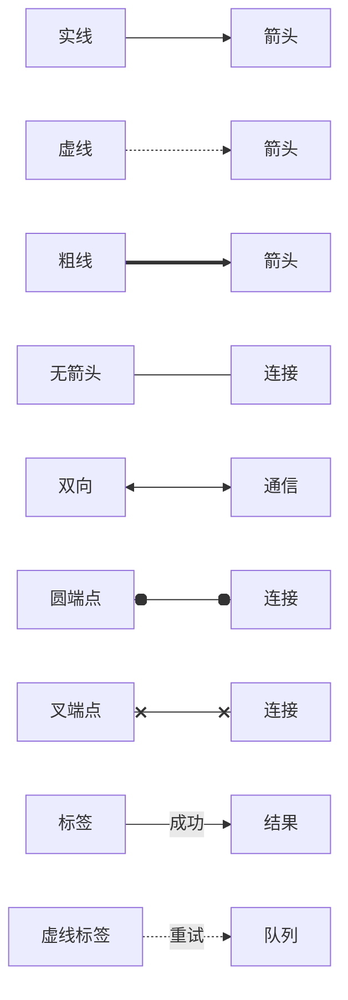
```mermaid
flowchart LR
    A[实线] --> B[箭头]
    C[虚线] -.-> D[箭头]
    E[粗线] ==> F[箭头]
    G[无箭头] --- H[连接]
    I[双向] <--> J[通信]
    K[圆端点] o--o L[连接]
    M[叉端点] x--x N[连接]
    O[标签] -->|成功| P[结果]
    Q[虚线标签] -.重试.-> R[队列]
```

## 07. 自定义节点与连线样式

检查自定义颜色在浅色、深色预览中的表现。

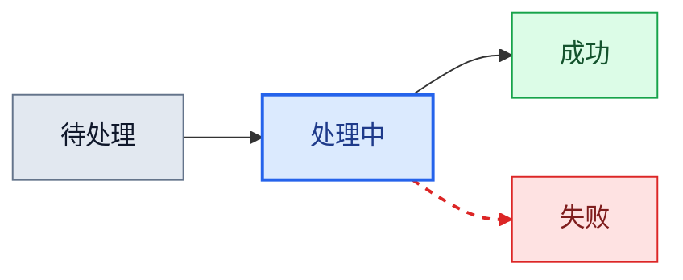
```mermaid
flowchart LR
    A[待处理] --> B[处理中]
    B --> C[成功]
    B --> D[失败]
    classDef pending fill:#e2e8f0,stroke:#64748b,color:#0f172a
    classDef active fill:#dbeafe,stroke:#2563eb,color:#1e3a8a,stroke-width:2px
    classDef success fill:#dcfce7,stroke:#16a34a,color:#14532d
    classDef failure fill:#fee2e2,stroke:#dc2626,color:#7f1d1d
    class A pending
    class B active
    class C success
    class D failure
    linkStyle 2 stroke:#dc2626,stroke-width:2px,stroke-dasharray:5 5
```

## 08. Markdown 标签与多行中文

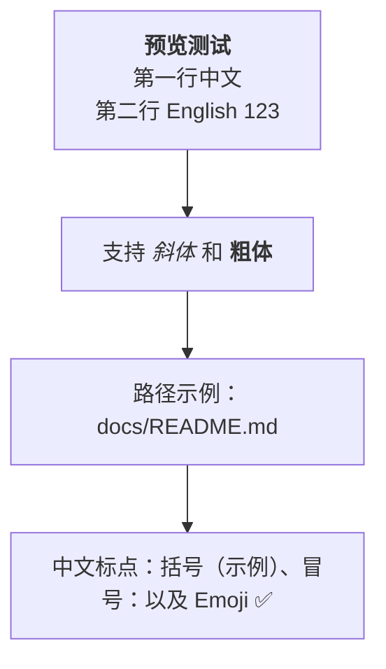
```mermaid
flowchart TD
    A["`**预览测试**
    第一行中文
    第二行 English 123`"]
    B["`支持 *斜体* 和 **粗体**`"]
    C["路径示例：docs/README.md"]
    D["中文标点：括号（示例）、冒号：以及 Emoji ✅"]
    A --> B --> C --> D
```

## 09. 时序图：激活、循环、条件与注释

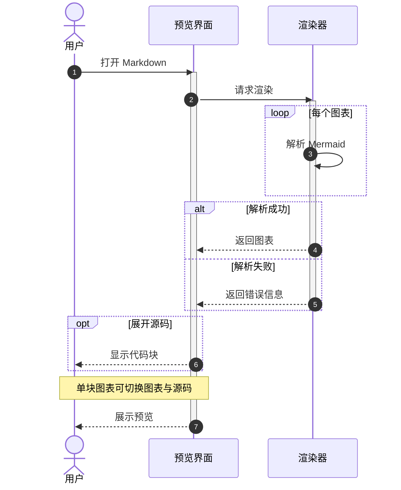
```mermaid
sequenceDiagram
    autonumber
    actor User as 用户
    participant UI as 预览界面
    participant Renderer as 渲染器
    User->>UI: 打开 Markdown
    activate UI
    UI->>Renderer: 请求渲染
    activate Renderer
    loop 每个图表
        Renderer->>Renderer: 解析 Mermaid
    end
    alt 解析成功
        Renderer-->>UI: 返回图表
    else 解析失败
        Renderer-->>UI: 返回错误信息
    end
    deactivate Renderer
    opt 展开源码
        UI-->>User: 显示代码块
    end
    Note over User,UI: 单块图表可切换图表与源码
    UI-->>User: 展示预览
    deactivate UI
```

## 10. 时序图：并行与临界区

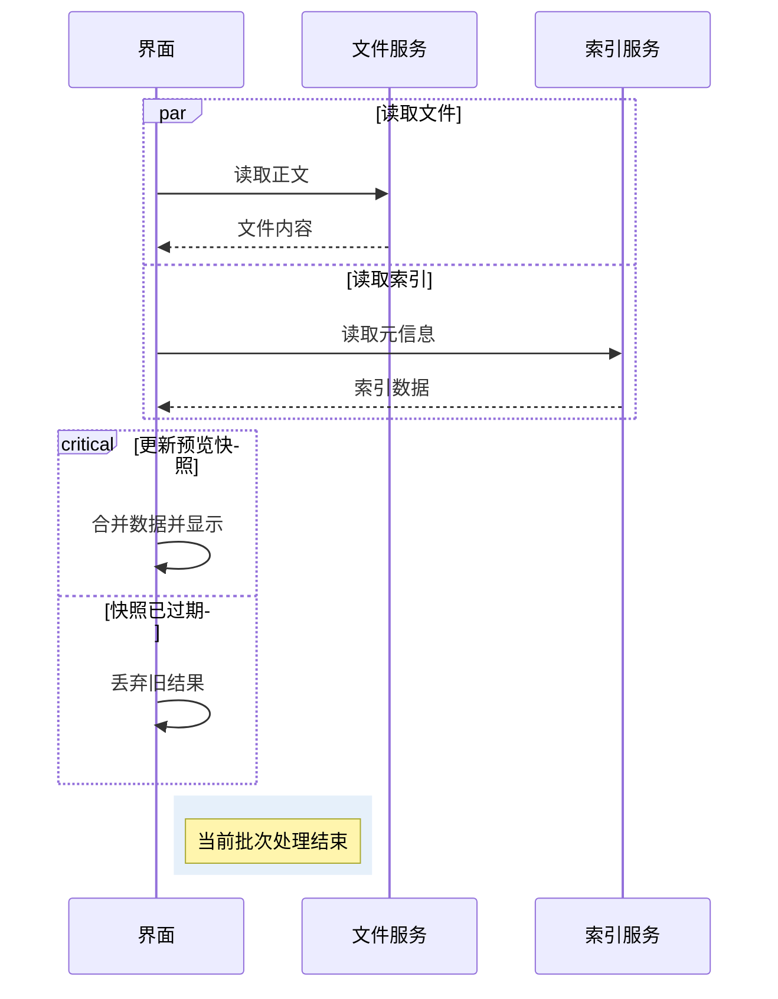
```mermaid
sequenceDiagram
    participant UI as 界面
    participant Files as 文件服务
    participant Index as 索引服务
    par 读取文件
        UI->>Files: 读取正文
        Files-->>UI: 文件内容
    and 读取索引
        UI->>Index: 读取元信息
        Index-->>UI: 索引数据
    end
    critical 更新预览快照
        UI->>UI: 合并数据并显示
    option 快照已过期
        UI->>UI: 丢弃旧结果
    end
    rect rgb(230, 240, 250)
        Note right of UI: 当前批次处理结束
    end
```

## 11. 类图：继承、接口、组合与泛型

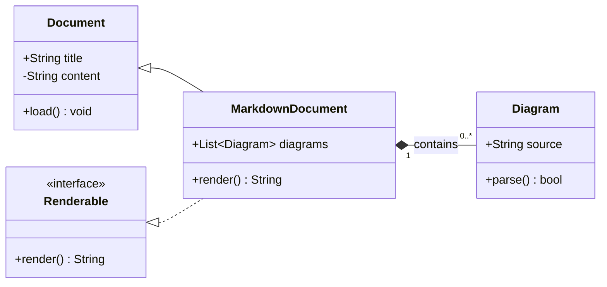
```mermaid
classDiagram
    direction LR
    class Renderable {
        <<interface>>
        +render() String
    }
    class Document {
        +String title
        -String content
        +load() void
    }
    class MarkdownDocument {
        +List~Diagram~ diagrams
        +render() String
    }
    class Diagram {
        +String source
        +parse() bool
    }
    Document <|-- MarkdownDocument
    Renderable <|.. MarkdownDocument
    MarkdownDocument "1" *-- "0..*" Diagram : contains
```

## 12. 状态图：嵌套状态与注释

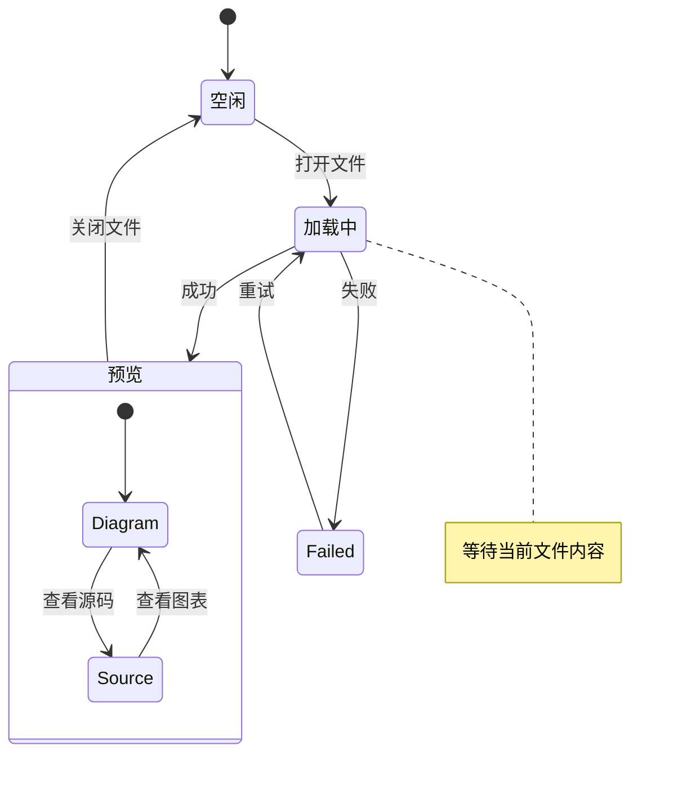
```mermaid
stateDiagram-v2
    [*] --> Idle
    state "空闲" as Idle
    state "加载中" as Loading
    state "预览" as Preview {
        [*] --> Diagram
        Diagram --> Source: 查看源码
        Source --> Diagram: 查看图表
    }
    Idle --> Loading: 打开文件
    Loading --> Preview: 成功
    Loading --> Failed: 失败
    Failed --> Loading: 重试
    Preview --> Idle: 关闭文件
    note right of Loading
        等待当前文件内容
    end note
```

## 13. 状态图：并发、分叉与汇合

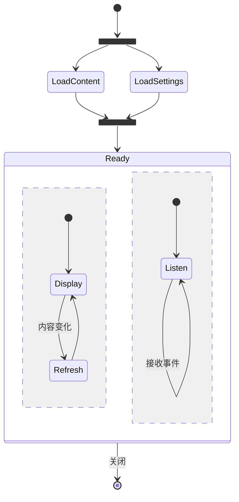
```mermaid
stateDiagram-v2
    state Split <<fork>>
    state Join <<join>>
    [*] --> Split
    Split --> LoadContent
    Split --> LoadSettings
    LoadContent --> Join
    LoadSettings --> Join
    Join --> Ready
    state Ready {
        [*] --> Display
        Display --> Refresh: 内容变化
        Refresh --> Display
        --
        [*] --> Listen
        Listen --> Listen: 接收事件
    }
    Ready --> [*]: 关闭
```

## 14. 实体关系图：基数与字段

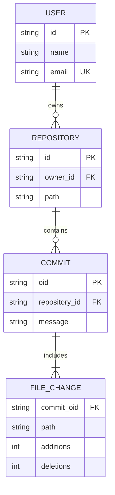
```mermaid
erDiagram
    USER ||--o{ REPOSITORY : owns
    REPOSITORY ||--o{ COMMIT : contains
    COMMIT ||--|{ FILE_CHANGE : includes
    USER {
        string id PK
        string name
        string email UK
    }
    REPOSITORY {
        string id PK
        string owner_id FK
        string path
    }
    COMMIT {
        string oid PK
        string repository_id FK
        string message
    }
    FILE_CHANGE {
        string commit_oid FK
        string path
        int additions
        int deletions
    }
```

## 15. 用户旅程图

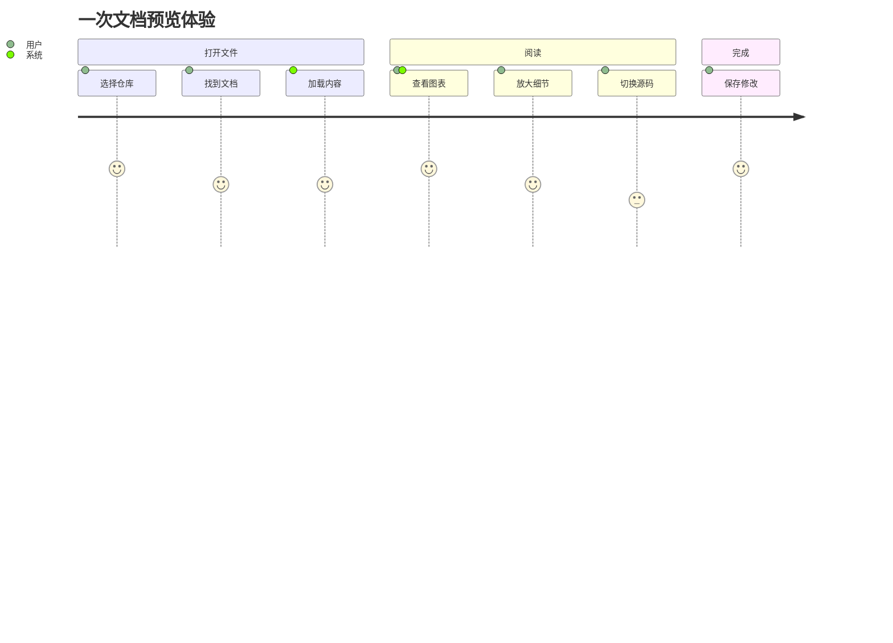
```mermaid
journey
    title 一次文档预览体验
    section 打开文件
      选择仓库: 5: 用户
      找到文档: 4: 用户
      加载内容: 4: 系统
    section 阅读
      查看图表: 5: 用户, 系统
      放大细节: 4: 用户
      切换源码: 3: 用户
    section 完成
      保存修改: 5: 用户
```

## 16. 甘特图：依赖、里程碑与关键任务

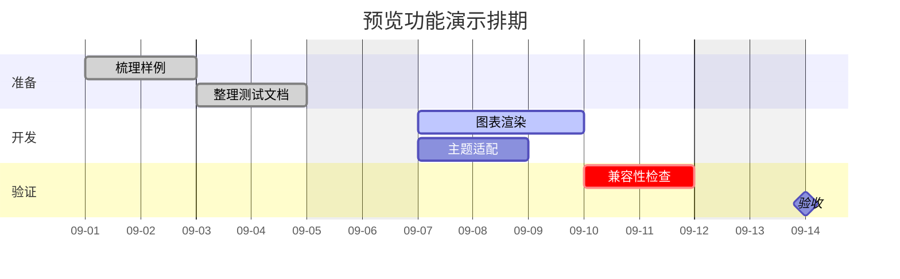
```mermaid
gantt
    title 预览功能演示排期
    dateFormat YYYY-MM-DD
    axisFormat %m-%d
    excludes weekends
    todayMarker off
    section 准备
    梳理样例       :done, a1, 2026-09-01, 2d
    整理测试文档   :done, a2, after a1, 2d
    section 开发
    图表渲染       :active, b1, after a2, 3d
    主题适配       :b2, after a2, 2d
    section 验证
    兼容性检查     :crit, c1, after b1 b2, 2d
    验收           :milestone, m1, after c1, 0d
```

## 17. 饼图

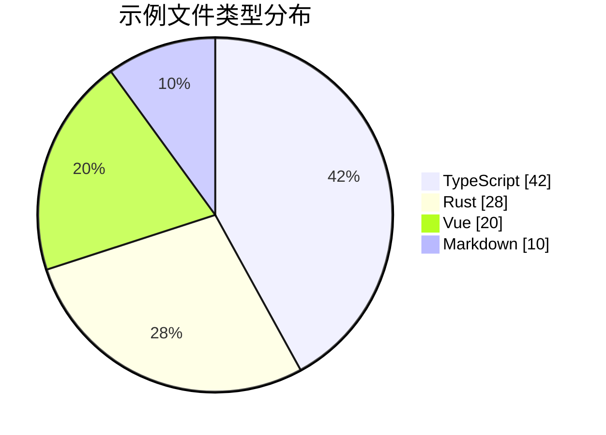
```mermaid
pie showData
    title 示例文件类型分布
    "TypeScript" : 42
    "Rust" : 28
    "Vue" : 20
    "Markdown" : 10
```

## 18. 象限图

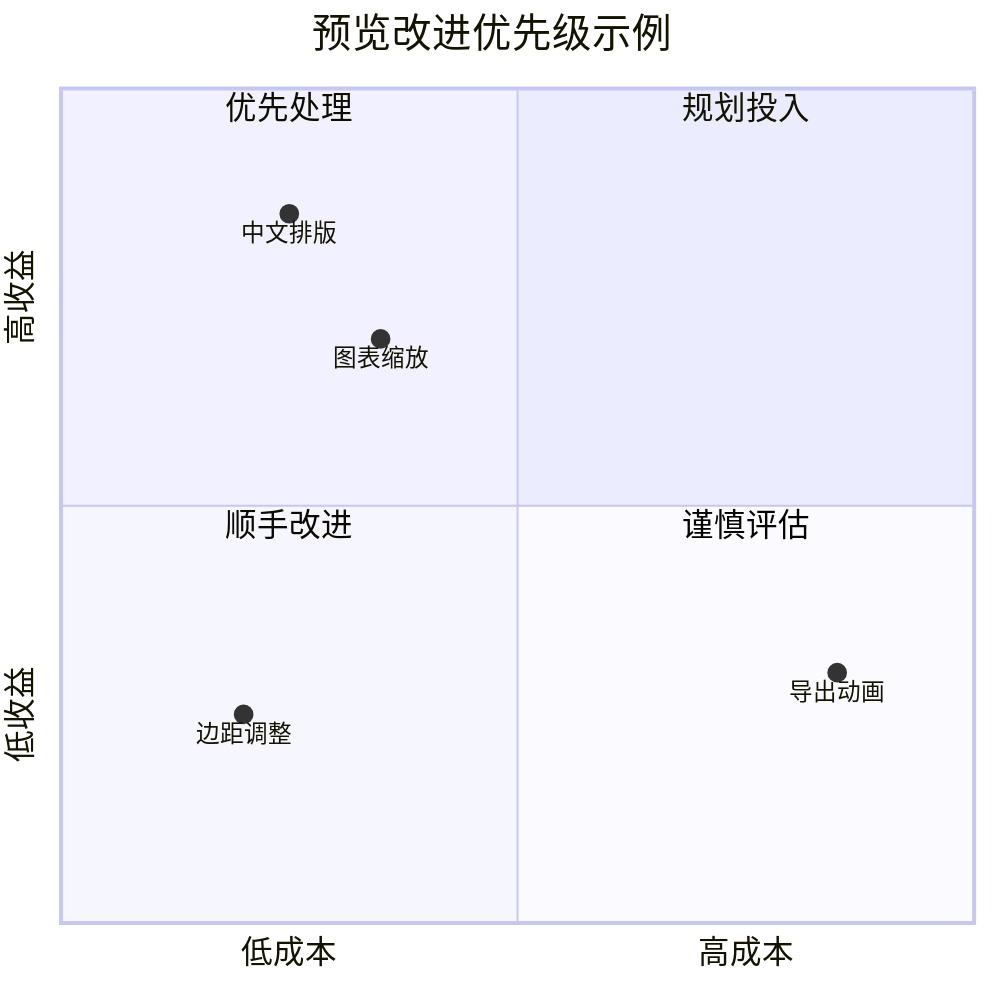
```mermaid
quadrantChart
    title 预览改进优先级示例
    x-axis 低成本 --> 高成本
    y-axis 低收益 --> 高收益
    quadrant-1 规划投入
    quadrant-2 优先处理
    quadrant-3 顺手改进
    quadrant-4 谨慎评估
    中文排版: [0.25, 0.85]
    图表缩放: [0.35, 0.70]
    导出动画: [0.85, 0.30]
    边距调整: [0.20, 0.25]
```

## 19. 需求图

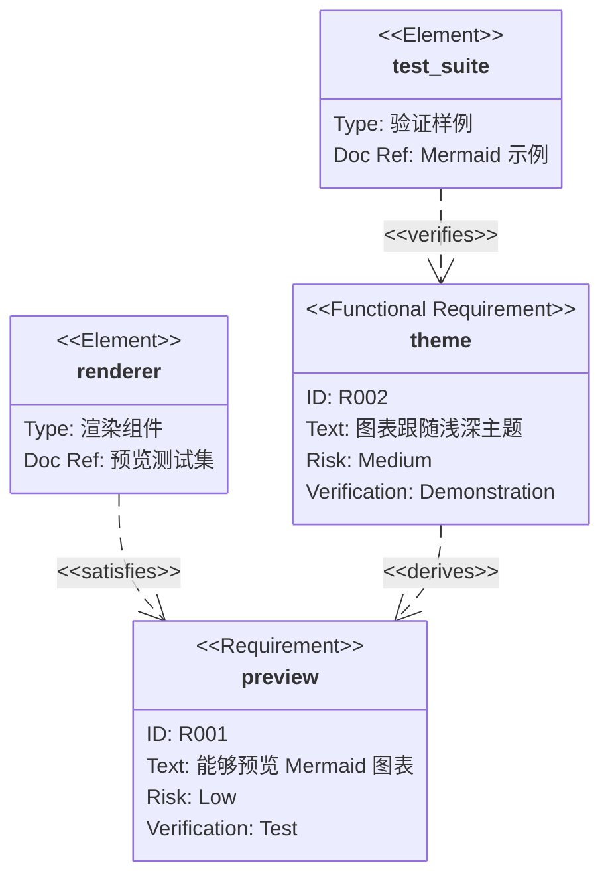
```mermaid
requirementDiagram
    requirement preview {
        id: R001
        text: "能够预览 Mermaid 图表"
        risk: low
        verifymethod: test
    }
    functionalRequirement theme {
        id: R002
        text: "图表跟随浅深主题"
        risk: medium
        verifymethod: demonstration
    }
    element renderer {
        type: "渲染组件"
        docref: "预览测试集"
    }
    element test_suite {
        type: "验证样例"
        docref: "Mermaid 示例"
    }
    renderer - satisfies -> preview
    theme - derives -> preview
    test_suite - verifies -> theme
```

## 20. Git 图：分支、合并与标签

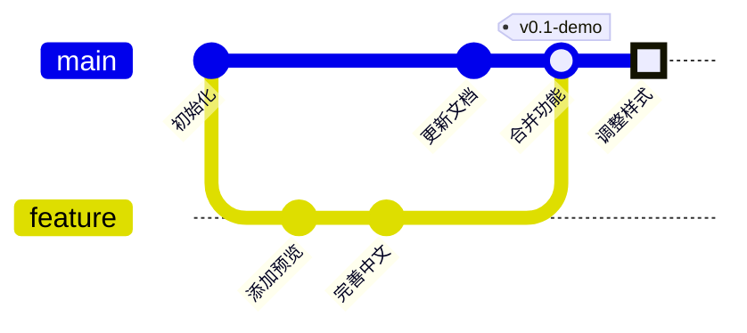
```mermaid
gitGraph LR:
    commit id: "初始化"
    branch feature
    checkout feature
    commit id: "添加预览"
    commit id: "完善中文"
    checkout main
    commit id: "更新文档"
    merge feature id: "合并功能" tag: "v0.1-demo"
    commit id: "调整样式" type: HIGHLIGHT
```

## 21. Git 图：纵向与 Cherry-pick

```mermaid
gitGraph TB:
    commit id: "base"
    branch fix
    checkout fix
    commit id: "patch"
    checkout main
    commit id: "prepare"
    cherry-pick id: "patch"
    commit id: "release" tag: "demo"
```

## 22. 思维导图

```mermaid
mindmap
  root((预览检查))
    内容
      中文
      English
      多行文本
    布局
      横向
      纵向
      嵌套
    交互
      缩放
      源码切换
    主题
      浅色
      深色
```

## 23. 时间线

```mermaid
timeline
    title 示例功能演进
    section 基础阶段
      第一周 : Markdown 排版 : 代码高亮
      第二周 : 流程图 : 时序图
    section 完善阶段
      第三周 : 缩放交互 : 主题切换
      第四周 : 扩展图表 : 兼容性验证
```

## 24. 桑基图

此例使用英文节点名，以兼容当前版本的 CSV 语法解析。

```mermaid
sankey-beta

Input,Text,70
Input,Diagram,30
Text,Plain,60
Text,Highlighted,10
Diagram,Flowchart,18
Diagram,Sequence,12
```

## 25. XY 图：柱状图与折线叠加

```mermaid
xychart-beta
    title "每周预览次数（演示数据）"
    x-axis [Mon, Tue, Wed, Thu, Fri, Sat, Sun]
    y-axis "次数" 0 --> 100
    bar [30, 45, 62, 58, 80, 40, 25]
    line [25, 40, 55, 60, 72, 48, 32]
```

## 26. XY 图：横向柱状图

```mermaid
xychart-beta horizontal
    title "图表样例数量"
    x-axis [Flow, Sequence, State, Other]
    y-axis "数量" 0 --> 20
    bar [12, 6, 4, 18]
```

## 27. 块图：列布局与跨列

```mermaid
block-beta
    columns 3
    Header["预览窗口"]:3
    Sidebar["目录"] Content["文档内容"] Tools["工具栏"]
    space:3
    Footer["状态栏"]:3
    Header --> Content
    Content --> Footer
    style Header fill:#dbeafe,stroke:#2563eb,color:#1e3a8a
```

## 28. 数据包图：位字段

这是自定义演示格式，不对应真实网络协议。

```mermaid
packet-beta
    0-3: "Version"
    4-7: "Flags"
    8-15: "Type"
    16-31: "Length"
    32-63: "Request ID"
    64-95: "Payload"
```

## 29. 看板图：任务与元信息

```mermaid
kanban
    todo[待办]
        task1[补充流程图]
        task2[检查深色主题]@{ assigned: '小林', priority: 'High' }
    doing[进行中]
        task3[预览测试]@{ assigned: '小周', priority: 'Very High' }
    review[待检查]
        task4[核对中文标签]
    done[已完成]
        task5[整理文档]
```

## 30. 架构图：分组与内置图标

只使用 Mermaid 内置图标，避免依赖额外图标包。语法见[架构图文档](https://mermaid.js.org/syntax/architecture)。

```mermaid
architecture-beta
    group app(cloud)[Preview Service]
    service api(server)[API] in app
    service cache(database)[Cache] in app
    service files(disk)[Files] in app
    service client(internet)[Client]
    client:R --> L:api
    api:R --> L:cache
    api:B --> T:files
```

## 31. 雷达图：多组数据

```mermaid
radar-beta
    title 预览体验对比示例
    axis speed["速度"], clarity["清晰度"], coverage["覆盖率"], usability["易用性"], stability["稳定性"]
    curve current["方案甲"]{80, 90, 70, 85, 95}
    curve proposed["方案乙"]{90, 85, 95, 80, 90}
    showLegend true
    max 100
    min 0
    graticule polygon
    ticks 5
```

## 32. 矩形树图：层级与占比

```mermaid
treemap-beta
    "前端"
        "组件": 36
        "状态管理": 14
        "工具函数": 10
    "后端"
        "接口": 18
        "核心逻辑": 32
    "文档"
        "设计文档": 12
        "使用说明": 8
```

## 33. C4：系统上下文

以下五个 C4 示例均为虚构文档系统。

```mermaid
C4Context
    title 文档系统上下文
    Person(reader, "读者", "阅读文档与图表")
    System(preview, "文档预览系统", "渲染 Markdown 与图表")
    System_Ext(repository, "文档仓库", "存储文档版本")
    Rel(reader, preview, "阅读")
    Rel(preview, repository, "获取文档")
```

## 34. C4：容器

```mermaid
C4Container
    title 文档系统容器
    Person(reader, "读者")
    System_Boundary(system, "文档系统") {
        Container(web, "预览界面", "Web", "显示文档")
        Container(api, "文档接口", "Service", "读取内容")
        ContainerDb(db, "文档存储", "Database", "保存文档")
    }
    Rel(reader, web, "访问")
    Rel(web, api, "请求文档", "HTTPS")
    Rel(api, db, "读取")
```

## 35. C4：组件

```mermaid
C4Component
    title 文档接口组件
    Container(web, "预览界面", "Web")
    Container_Boundary(api, "文档接口") {
        Component(controller, "入口", "Controller", "接收请求")
        Component(parser, "解析器", "Parser", "解析内容")
        Component(cache, "缓存", "Cache", "复用结果")
    }
    Rel(web, controller, "请求")
    Rel(controller, parser, "解析")
    Rel(parser, cache, "查询")
```

## 36. C4：动态交互

```mermaid
C4Dynamic
    title 文档读取流程
    Person(reader, "读者")
    Container(web, "预览界面", "Web")
    Container(api, "文档接口", "Service")
    ContainerDb(db, "存储", "Database")
    Rel(reader, web, "打开文档")
    Rel(web, api, "请求正文")
    Rel(api, db, "读取记录")
    Rel(api, web, "返回内容")
```

## 37. C4：部署

```mermaid
C4Deployment
    title 文档系统部署示例
    Deployment_Node(device, "用户设备", "Desktop") {
        Container(client, "预览客户端", "WebView")
    }
    Deployment_Node(server, "服务节点", "Linux") {
        Container(api, "文档服务", "HTTP Service")
        ContainerDb(db, "文档库", "Database")
    }
    Rel(client, api, "请求内容", "HTTPS")
    Rel(api, db, "读取")
```

## 38. 目录树图

检查缩进层级、中文描述与内置图标；语法见[目录树图文档](https://mermaid.js.org/syntax/treeView.html)。

```mermaid
---
config:
  treeView:
    showIcons: true
---
treeView-beta
    demo/
        docs/
            overview.md
            diagrams.md
        src/
            components/
                Preview.vue
            main.ts
        README.md
```

## 39. 韦恩图

```mermaid
venn-beta
    title 文档质量的交集
    set Clear["清晰"]
    set Accurate["准确"]
    set Complete["完整"]
    union Clear,Accurate["可信表达"]
    union Accurate,Complete["信息充分"]
    union Clear,Complete["容易理解"]
    union Clear,Accurate,Complete["优质文档"]
```

## 40. 鱼骨图：原因分析

```mermaid
ishikawa-beta
    图表显示异常
    语法
        引号未闭合
        缩进不一致
    环境
        版本过旧
        字体缺失
    内容
        标签过长
        节点过多
    显示
        容器过窄
        缩放比例不合适
```

## 41. Wardley 价值链地图

```mermaid
wardley-beta
    title 文档预览价值链示例
    anchor Reader [0.95, 0.55]
    component Preview [0.80, 0.45]
    component Renderer [0.60, 0.62]
    component Storage [0.30, 0.82]
    Reader -> Preview
    Preview -> Renderer
    Renderer -> Storage
    evolve Renderer 0.85
    note "复用成熟的渲染能力" [0.45, 0.35]
```

## 42. Cynefin 框架图

```mermaid
cynefin-beta
    title 预览问题分类示例
    complex
        "探索新的阅读方式"
    complicated
        "分析复杂布局问题"
    clear
        "修正拼写与缩进"
    chaotic
        "恢复不可用的预览"
    confusion
        "尚未定位的问题"
```

## 43. 事件建模图

```mermaid
eventmodeling
    tf 01 ui PreviewScreen
    tf 02 cmd OpenDocument { path: string }
    tf 03 evt DocumentOpened { path: string }
    tf 04 cmd RenderDiagram { source: string }
    tf 05 evt DiagramRendered { id: string }
```

## 44. 泳道图

```mermaid
swimlane-beta LR
    subgraph Reader[读者]
        Open[打开文档]
        Read[阅读图表]
    end
    subgraph App[应用]
        Load[加载内容]
        Show[显示结果]
    end
    subgraph Renderer[渲染器]
        Parse[解析语法]
        Draw[生成图表]
    end
    Open --> Load --> Parse --> Draw --> Show --> Read
```

## 45. 铁路图：EBNF 语法

```mermaid
railroad-ebnf-beta
    title "简单标识符语法"
    letter = "a" | "b" | "c" ;
    digit = "0" | "1" | "2" ;
    identifier = letter, { letter | digit } ;
```

## 46. Mermaid 版本信息

可用来确认当前预览器实际加载的 Mermaid 版本。

```mermaid
info
```

## 47. Frontmatter：标题与局部配置

此例设置标题、曲线与间距。GitUI 的浅深主题由应用控制。

```mermaid
---
title: 带标题的流程图
config:
  flowchart:
    curve: stepBefore
    nodeSpacing: 35
    rankSpacing: 45
---
flowchart LR
    A[读取] --> B{缓存命中？}
    B -->|是| C[使用缓存]
    B -->|否| D[重新计算]
    C --> E[显示]
    D --> E
```

## 48. 注释与无障碍描述

`%%` 注释不应显示为节点；`accTitle` 与 `accDescr` 用于图表的无障碍元信息，通常不作为正文显示。

```mermaid
flowchart LR
    accTitle: 文档预览的三个步骤
    accDescr: 用户先选择文档，然后渲染图表，最后阅读结果。
    %% 这条注释不应成为可见节点
    A[选择文档] --> B[渲染图表] --> C[阅读结果]
```

## 49. 宽图：横向缩放与长标签

```mermaid
flowchart LR
    A[第一步：打开演示仓库] --> B[第二步：选择 Markdown 文档]
    B --> C[第三步：读取文档完整内容]
    C --> D[第四步：识别 Mermaid 代码块]
    D --> E[第五步：解析当前图表语法]
    E --> F[第六步：生成图表预览]
    F --> G[第七步：检查中文与连线]
    G --> H[第八步：切换主题并完成检查]
```

## 50. 长图：纵向滚动与分支

```mermaid
flowchart TD
    A([开始预览]) --> B[加载文档]
    B --> C[解析 Markdown]
    C --> D{包含图表？}
    D -->|是| E[准备图表]
    D -->|否| F[显示普通正文]
    E --> G[渲染当前图表]
    G --> H{渲染成功？}
    H -->|是| I[显示图表]
    H -->|否| J[显示源码与提示]
    I --> K{还有图表？}
    J --> K
    K -->|是| G
    K -->|否| L[检查整篇排版]
    F --> L
    L --> M[切换浅深主题]
    M --> N[检查缩放与滚动]
    N --> O([完成预览])
```

## 预览检查记录

- [ ] 所有图表能展示，且错误不会影响其他内容。
- [ ] 中文、英文、数字、标点和多行标签完整可读。
- [ ] 节点、箭头、图例、分组和边界没有意外裁切。
- [ ] 浅色与深色主题下，文字和连线都有足够对比度。
- [ ] 宽图可以缩放查看，长图可以正常滚动。
- [ ] 图表 / 源码切换和代码复制正常。
- [ ] 编辑后刷新预览，图表内容随之更新。

新类型的详细语法还可参考：[雷达图](https://mermaid.js.org/syntax/radar.html)、[矩形树图](https://mermaid.js.org/syntax/treemap)、[C4 图](https://mermaid.js.org/syntax/c4.html)。
